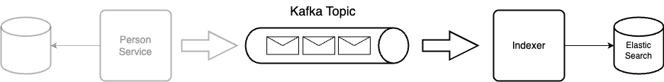
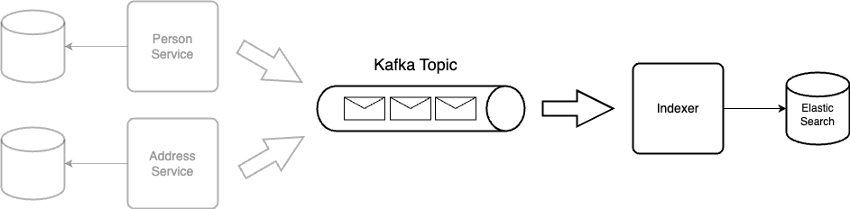

# Tech Bootcamp - Search Index

## Table of Contents
- [Overview](#overview)
- [Challenges](#challenges)
  - [Challenge 1 - Create the Indexer Service](#challenge-1---create-the-indexer-service)
  - [Challenge 2 - Consume messages from Multiple Services](#challenge-2---consume-messages-from-multiple-services)
  - [Challenge 3 - Improve the Indexer Service](#challenge-3---improve-the-indexer-service)
- [How to run](#how-to-run)
  - [Elastic Docker Setup](#elastic-docker-setup)
  - [Kafka Docker Setup](#kafka-docker-setup)
  - [Clean up](#clean-up)

## Overview

Welcome to the Quarkus-Kafka-Elasticsearch bootcamp challenge! 
This event is designed to test your skills in creating a scalable and efficient Elasticsearch indexer using Quarkus and Kafka. 
Your mission is to create a seamless integration between multiple backends and a centralized Elasticsearch datastore.

## Challenges

You will be provided with a Kafka topic and sample code to simulate multiple backends, each with their own database.
Your task is to develop the Indexer as a Quarkus application that consumes messages from the Kafka topic and indexes the data into a central readonly Elasticsearch index.
The solution should ensure data synchronization between Elasticsearch and the various backends, with a focus on searchability and performance, avoiding the use of a relational database for full-text and fuzzy search.

Requirements:

* Indexer: Create a Quarkus application that consumes messages from the given Kafka topic and indexes the data into a single Elasticsearch index, considering only the searchable fields of the entities.
* Multi-field Search: Enable users to search multiple fields simultaneously across different backends. Returning just the entity IDs as the query result is sufficient. The actual data can be retrieved from the backend directly. The specific searchable fields are: lastname, firstname, city, and street.
* Data Synchronization: Ensure that Elasticsearch is always in-sync with the different backends, maintaining data integrity and consistency.
* Extensibility: Although partial updates and deletes are not considered in this challenge, design the indexer in a way that allows for easy extension to handle these operations in the future.

Deliverables:

* Source code for the Quarkus application that consumes messages from the Kafka topic and indexes them into Elasticsearch.
* Documentation detailing the architecture, data flow, and design decisions made during the development process.
* A brief demo showcasing the functionality and performance of the developed solution, including the multi-field search capability and data synchronization between Elasticsearch and backends.

### Challenge 1 - Create the indexer service
In this part you are tasked with creating the Indexer as a Quarkus application that indexes person data and their associated addresses from a single backend into a single Elasticsearch index.



* Assume there is only one backend sending person data, including their associated addresses.
* If a person message comes in twice (e.g., because of an update), simply overwrite the existing document in Elasticsearch.
* Create a single Elasticsearch index to store the person and address data, choose a nested or parent/child document structure that is optimized for search performance.

A query for the created index might look like this:
```luce
{
  "_source": ["_id"],
  "query": {
    "multi_match": {
      "query": "John Smith Main St",
      "fields": ["firstName", "lastName", "addresses.street"]
    }
  }
}
```

### Challenge 2 - Consume messages from multiple services
In the second part of the  challenge, you need the extend the Quarkus app in order to index person data and their associated addresses from two separate backend services: the person service and the address service. 
The solution must handle the relationship between persons and their multiple addresses, as well as updates to addresses, ensuring data consistency and search performance.



* Assume there are two backends, person service and address service, each sending its own data to the Kafka topic.
* To simplify the challenge, assume that an address message is always sent after its associated person message, and the ordering of the messages in a partition is guaranteed.
* A person can have multiple addresses, and the indexer should store this relationship in Elasticsearch.
* Ensure that updates to a person's addresses, such as adding a new address, are reflected in Elasticsearch.

### Challenge 3 - Improve the Indexer Service

* Improve the solution in order to handle messages from different backend services that can arrive in a random order, including the possibility that an address message arrives before its associated person message.
Explore different solutions.:
  * On the consumer side by introducing caching, buffering, or other techniques.
  * On the producer side by synchronizing the backends to ensure that the messages are sent in the correct order.
  * Creating a clever document structure in Elasticsearch that allows adding a child (address) before the parent (person).
  * Using Kafka Streams to join parent with child or reorder the messages.


* Extend the search capabilities of the existing solution.
  * Enhance the schema and queries to support fuzzy search and field-based scoring, allowing for matches even when there are slight variations in the search terms (e.g., "Meier" also matches "Meyer").
  * Introduce a scoring mechanism to prioritize search results based on the relevance of different fields, such as lastName having a higher score than firstName, and firstName having a higher score than the address fields.
  * Add user-specific meta information, such as the user's workplace, to influence the search results. For example, if a user works in City X, prioritize people living in City X in the search results.


* Implementing a full data load or initial load strategy (aka the infamous Data Creator)
* Implement a mechanism to replay the Kafka topic.
* Explore the possibility to sync the PostgreSql database with Elasticsearch by using Debezium and Kafka Connect.

## How to run
Please note that the instructions provided are specific to running Elastic and Kafka using Docker. If you have Elastic and Kafka running on your local machine, you can skip this step.

### Run Elastic with Docker
There is a Docker Compose file that defines two services for running Elastic and Kibana on your local machine.

1. `cd bootcamp-search-index/docker/elastic`
2. `docker-compose up -d`


Access Kibana UI: http://localhost:5601

username: `elastic`

password: `elastic`

### Run Kafka with Docker
The Docker Compose file sets up a Confluent Kafka cluster with a Zookeeper node, a single broker, a Schema Registry, Kafka Connect, the Control Center and a KSQLDB server.

1. `cd bootcamp-search-index/docker/kafka`
2. `docker-compose up -d`

Access Kafka Control Center UI: http://localhost:9021

###  Clean up
`docker-compose down -v`

Removes all containers, volumes and networks